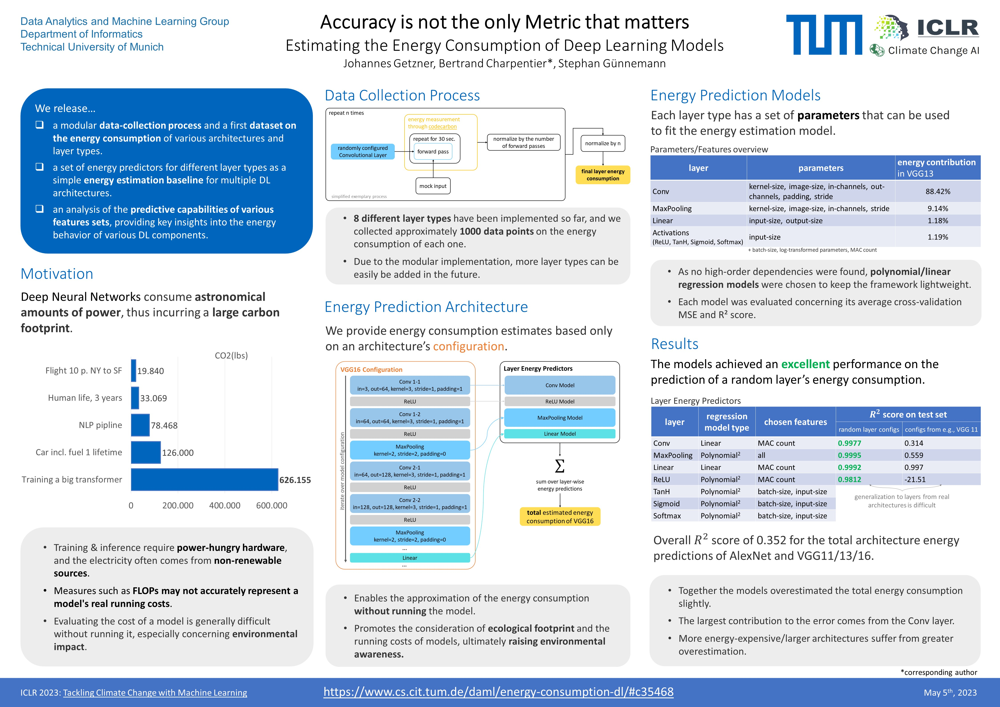

# Deep Learning Energy Estimator

## Accuracy is not the only Metric that matters: Estimating the Energy Consumption of Deep Learning Models

## About this project

Deep CNNs, such as VGG16 [Simonyan & Zisserman (2014)](https://arxiv.org/abs/1409.1556) or
ResNet50 [He et al., 2015](http://arxiv.org/abs/1512.03385) already deliver great performance.
Yet the increasing number of layers in such models comes at the cost of severely increased computational complexity,
resulting in the need for power-hungry
hardware [Thompson et al., 2020](https://arxiv.org/abs/2007.05558); [Jin et al., 2016](http://arxiv.org/abs/1611.04581).
An example of a model that
behaves extremely poorly in this regard is a big transformer with neural architecture
search [Strubell et al., 2019](http://arxiv.org/abs/1906.02243).
Clearly, training and running these models is not just a matter of financial cost, but also environmental impact. Yet,
deep learning models are often only evaluated concerning standard performance metrics like accuracy or inference time,
but not energy consumption or ecological footprint. While advancements in the research field often take precedence
over energy considerations, this trade-off between performance and environmental impact should still be taken into
account, despite the difficulty in accurately reporting these metrics due to a lack of appropriate tools [Lacoste et
al., 2019](http://arxiv.org/abs/1910.09700); [Garcıa- Martın et al., 2019](https://www.sciencedirect.com/science/article/pii/S0743731518308773).

In light of these motivations, we developed a pipeline to collect model energy data and to approximate a model’s
energy consumption, before training and without the need for direct energy measurement. Not only would this approach
be more efficient and environmentally friendly, but it would also enable deep learning engineers to more easily
facilitate the tradeoff between performance and environmental impact. To achieve this goal, we attempt to compute the
energy consumption of various deep learning architectures as the sum of layer-wise estimated energies.

The original paper can be found [here](https://github.com/JohannesGetzner/dl-energy-estimator/blob/main/Accuracy%20is%20not%20the%20only%20Metric%20that%20matters.pdf) or on [arvix](https://arxiv.org/abs/2304.00897). The recording of the presentation and the slides are available on the [Tackling Climate Change with Machine Learning]() website (link will follow soon). 
For more information visit the project [website](https://www.cs.cit.tum.de/daml/energy-consumption-dl/#c35468) and the website of the [Data Analytics and Machine Learning Group](https://www.cs.cit.tum.de/daml/startseite/) at the Technical University of Munich.

## About the structure of this repository

- **./data** contains the raw file outputs by codecarbon, the '...slurm-log.out' files correspond come from the cluster
  the collection process was run on.
- **./data_collectors** contains the parent data_collector class and the corresponding child-class implementation for
  each module used in the data-collection process
- **./estimator** contains everything related to the final predictors on both the layer- and model-level
    - **./data** contains the parsed and normalized data files used for training (see the 'generate_datasets.ipynb'
      notebook for details)
    - **./models** contains the custom model classes that implement the best models for each layer type
    - **./serialized_models** contains the serialized trained energy predictors, pre- and postprocessors for each
      layer-type
- **./experiments** contains a set of jupyter notebooks with the results presented in the paper
- **./utils** a set of python scripts that contain useful custom functions
- **./** besides the above, the .yaml files are required for the configuration of the data-collection, training and
  inference process. See the 'run_....py' files for more details

## Installation

### Install the requirements

    pip install -r requirements.txt

## Getting Started

### Intel RAPL

codecarbon reads the Intel RAPL files for the energy information. Before the data-collection process can run, make sure
your system allows these files to be read: `sudo chmod 555 -R /sys/class/powercap/intel-rapl/` (also see the './give_RAPL_read_access.sh' script)

## Running the project

### Data Collection

Before attempting to start the process please review the *data_collection_config.yaml* file in the root of the
repository. Subsequently, the data-collection process can be started by simply running `python run_data_collection.py`

### Model Fitting

The model fitting procedure uses the models implemented in ./estimator/models and fits them to the data automatically.
Please make sure that the corresponding data files are available and before attempting to start the process please
review the *model_fitting_and_estimation_config.yaml* file in the root of
the repository. Subsequently, the model-fitting process can be started by simply
running `python run_fit_models.py`. The serialized models will be saved automatically in the corresponding folder.

### Inference

Given the serialized models, the system is capable of estimating the energy consumption of a variety of architectures.
By running `python run_estimation.py` the system will attempt to predict the energy consumption of the models specified
in the *model_fitting_and_estimation_config.yaml*.

## Acknowledgments

First and foremost, I would like to express my deep gratitude to my supervisor [Bertrand Charpentier](https://www.cs.cit.tum.de/daml/team/bertrand-charpentier/), from the [DAML Group](https://www.cs.cit.tum.de/daml/startseite/) at the Technical University of Munich, led by [Prof. Dr. Stephan Günnemann](https://www.cs.cit.tum.de/en/daml/team/damlguennemann/), for his unwavering support, guidance, and valuable feedback throughout the entire duration of this project. 
His insights and expertise were crucial in shaping the direction of our research and bringing it to success. Without their constant support and encouragement, this work would not have been possible.

Additionally, I would like to acknowledge the contribution of my former group member [Ahmed Darwish](https://github.com/Shiro-Raven), who provided valuable code during the early stages of this project. Thank you for your help.

## Poster

